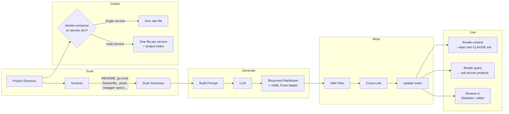
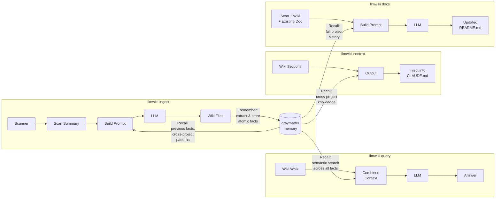

# llmwiki

**You can't keep 30 projects in your head. Neither can your AI coding assistant.**

Every developer hits a cognitive wall. You switch from the billing API to the notification service and spend 20 minutes re-reading code just to remember how it's wired together. You onboard onto a client's codebase and the architecture lives in someone's head — or worse, in a stale Confluence page from 2022. Your AI pair programmer starts every session blind, re-discovering the same project structure you explained yesterday.

`llmwiki` fixes this. It scans your project directories and generates a persistent, LLM-maintained markdown knowledge base that compounds over time. Every project gets a structured wiki entry with architecture diagrams, API documentation, integration maps, and cross-references — written by an LLM that actually reads your code, not by a developer who "will document it later."

Inspired by [Karpathy's LLM Wiki pattern](https://x.com/karpathy/status/1908184210424959371). Plain markdown files. No database. No SaaS. Browsable in any editor. Injectable into AI coding sessions. Version-controlled with git.


## The Problem

You manage multiple projects across multiple clients. Each project has its own stack, its own services, its own integration points. You context-switch between them daily. The knowledge you need is scattered across READMEs that were last updated when the project was bootstrapped, docker-compose files that hint at the architecture, and tribal knowledge that lives in Slack threads.

Your AI coding assistant starts every conversation from zero — it reads the files you point it at but has no understanding of the broader system, the other services, or why things are structured the way they are.

**What if every project had a living, always-current technical wiki — and your AI assistant could read it before writing a single line of code?**

## What llmwiki Generates

One command scans a project and produces a comprehensive wiki entry:

```bash
llmwiki ingest ~/workspace/my-api
```

The output is a structured markdown file with:
- **Domain & Architecture** — what the project does, how it's structured, key design decisions
- **Service map** — every microservice with its purpose, tech stack, and responsibilities
- **Mermaid diagrams** — system architecture flowcharts and entity-relationship diagrams, rendered in GitHub/Obsidian
- **API documentation** — endpoints extracted from swagger/openapi specs
- **Integration map** — databases, message queues, external APIs with protocols and auth methods
- **Configuration reference** — environment variables, feature flags, runtime modes
- **Auto-generated tags** — technologies and patterns in YAML front matter (`go, grpc, event-driven, kubernetes, ...`)

For clients with multiple projects, `llmwiki` generates **executive summaries** with C4 system landscape diagrams showing how everything fits together.

Every wiki file is cross-linked — mention a service name and it becomes a clickable reference to that service's wiki page.

## How It Works

### Core Pipeline



### With Graymatter Memory

When `memory_enabled: true`, [graymatter](https://github.com/angelnicolasc/graymatter) adds a persistent memory layer. Knowledge compounds across ingestion runs — the LLM sees what it learned before, cross-project patterns surface automatically, and the `query` command gets semantic search instead of brute-force file walking.



**Memory stores facts at two levels:**
- **Per-project** (`llmwiki/project/{name}`) — architecture, integrations, tech stack, service topology
- **Per-customer** (`llmwiki/customer/{name}`) — shared infrastructure, cross-project patterns, technology standards

Facts decay over time (30-day half-life) and consolidate in the background. Embedding search uses whatever's available: Ollama → OpenAI → Anthropic → keyword-only fallback.

## Install

Builds are published for macOS (arm64, amd64) and Linux (amd64, arm64).

### Quick download (pre-built binary)

Pick your platform and grab the tarball straight from the [latest release](https://github.com/emgiezet/llmwiki/releases/latest):

| Platform        | Asset                                            |
|-----------------|--------------------------------------------------|
| macOS Apple Silicon | `llmwiki_<version>_darwin_arm64.tar.gz`     |
| macOS Intel     | `llmwiki_<version>_darwin_amd64.tar.gz`          |
| Linux x86_64    | `llmwiki_<version>_linux_amd64.tar.gz`           |
| Linux arm64     | `llmwiki_<version>_linux_arm64.tar.gz`           |

With the [GitHub CLI](https://cli.github.com/) — downloads + extracts in one step:

```bash
gh release download --repo emgiezet/llmwiki --pattern '*darwin_arm64.tar.gz' -O - | tar -xz
sudo mv llmwiki /usr/local/bin/        # or: mv llmwiki ~/.local/bin/
```

Each release also ships `checksums.txt` (SHA256). The one-liner installer below verifies it for you.

### One-liner installer (recommended)
```bash
curl -fsSL https://raw.githubusercontent.com/emgiezet/llmwiki/main/install.sh | sh
```
Installs the latest release to `~/.local/bin/llmwiki`, auto-detects OS/arch, and verifies the SHA256 checksum. If that directory isn't on your `$PATH`, the installer prints the exact `export PATH=…` line to add.

**Pinned version**
```bash
curl -fsSL https://raw.githubusercontent.com/emgiezet/llmwiki/main/install.sh | VERSION=v0.5.0 sh
```

**Custom install directory**
```bash
curl -fsSL https://raw.githubusercontent.com/emgiezet/llmwiki/main/install.sh | INSTALL_DIR=/usr/local/bin sh
```

**Manual download** — grab `llmwiki_<version>_<os>_<arch>.tar.gz` from the [Releases page](https://github.com/emgiezet/llmwiki/releases), verify the SHA256 against `checksums.txt`, extract, and move `llmwiki` into your `$PATH`.

**Go users**
```bash
go install github.com/emgiezet/llmwiki@latest
```

### Updating

`llmwiki` checks GitHub once every 24 hours (cached, non-blocking) and prints a one-line notice on stderr when a newer release exists:
```
llmwiki 0.5.1 available (you have 0.5.0) — run 'llmwiki update' to install.
```

Run `llmwiki update` to upgrade. The subcommand detects how the binary was installed and re-runs the installer script for release binaries, or `go install` for Go-managed installs. Supports `--version vX.Y.Z` to pin and `--dry-run` to preview.

The notice is suppressed in CI, non-TTY output, dev builds, and when `LLMWIKI_NO_UPDATE_CHECK=1` is set.

## Quick Start

```bash
# Set up a project (creates llmwiki.yaml + optional graymatter memory layer)
llmwiki init ~/workspace/my-project --customer acme --type client

# Ingest a project (uses Claude Code CLI by default)
llmwiki ingest ~/workspace/my-project

# See what's tracked
llmwiki list

# Feed context to your AI coding session
llmwiki context my-project --inject CLAUDE.md

# Ask questions across all your projects
llmwiki query "which services use gRPC?"

# Generate client-level executive summary
llmwiki index acme

# Update a project's stale README from wiki + memory
llmwiki docs ~/workspace/my-project --write
```

## Features

### Automatic service detection

Point `llmwiki` at a monorepo or multi-service project and it figures out the structure. It reads `docker-compose.yml`, scans for subdirectories with code indicators (`go.mod`, `package.json`, `composer.json`, `Dockerfile`, `pom.xml`, `src/`), and creates one wiki file per service.

### Mermaid diagrams

Every wiki entry includes LLM-generated system architecture diagrams and ERDs. Client-level indexes get C4 system landscape diagrams. All render natively in GitHub, GitLab, and Obsidian.

### Cross-file linking

When a wiki entry mentions another tracked project or service, `llmwiki` automatically creates a markdown link. The result is a navigable knowledge graph — click from the client overview to a project, from a project to a service, from a service to the database it depends on.

### AI coding integration

Inject wiki context directly into `CLAUDE.md` (or any file) with marker-based replacement:

```markdown
<!-- llmwiki:start -->
<!-- llmwiki:end -->
```

```bash
llmwiki context my-project --inject CLAUDE.md
```

Your AI assistant starts every session with Domain, Architecture, Services, and Flows already in context. No more "can you look at the codebase and figure out what this does."

### Incremental refinement

Re-running `ingest` doesn't regenerate from scratch — the LLM sees the previous wiki entry and refines it. Knowledge compounds. Details get richer with each pass.

### Change tracking & freshness

Documentation drifts the moment code changes. `llmwiki` tracks which source files each wiki entry describes, and tells you when those files have changed but the docs haven't.

At ingest time, each wiki entry's front matter gains an `llmwiki_tracking` block:

```yaml
llmwiki_tracking:
  area: internal/auth
  files:
    - internal/auth/handler.go
    - internal/auth/middleware.go
  hash: a3f9bc1d2e4f6a8b
  cluster_method: git-cochange
  updated_at: "2026-05-25"
```

llmwiki figures out areas from git co-change history: files that keep landing in the same commits get grouped together (union-find clustering, 30% co-occurrence threshold). On projects with fewer than 20 commits it falls back to top-level directory heuristics. The `hash` is a SHA256 over `git ls-tree HEAD` output for each tracked file, so it changes when file contents change. Timestamps don't enter into it.

Run the check anytime:

```bash
llmwiki check                       # report fresh/stale entries for the current project
llmwiki check --json                # machine-readable output
llmwiki check --exit-code           # exit 1 if anything is stale (for CI)
llmwiki check --files a.go,b.go     # restrict to areas containing these files
```

```
✓ clients/acme/billing-api.md   fresh   area: internal/auth   updated: 2026-05-25
✗ clients/acme/billing-api.md   STALE   area: internal/billing
```

Staleness shows up through three paths:

- **Manual / agent** — run `llmwiki check` yourself, or register it as a slash command so an AI agent runs it before handing work back.
- **Git pre-commit hook** — `llmwiki init --hooks` installs a `.git/hooks/pre-commit` that blocks the commit (`--exit-code`) when staged files belong to a stale area. If the doc update is deliberately deferred, `git commit --no-verify` gets you through. An existing pre-commit hook is left alone.
- **AI session Stop hook** — the graymatter Stop hook (see below) runs a non-blocking `llmwiki check` on the files touched during the session and records the result in memory.

### Docs alongside code (per-repo output mode)

By default wiki files live in the central `~/llmwiki/wiki/` tree. Set `output_mode` in `llmwiki.yaml` to also (or only) write them into the project repository, so a single PR diff shows both the code change and the doc change:

```yaml
output_mode: both              # central (default) | local | both
local_docs_dir: docs/llmwiki   # where local docs land (default)
```

- `central` — existing behaviour, wiki only in `~/llmwiki/wiki/`
- `local` — wiki only inside `<project>/<local_docs_dir>/`
- `both` — written to both locations

### Three LLM backends

| Backend | Config | Best for |
|---------|--------|----------|
| Claude Code CLI | `claude-code` (default) | Uses your Claude Code subscription. No API key needed. |
| Claude API | `claude-api` | Fast bulk ingestion. Requires `ANTHROPIC_API_KEY`. |
| Ollama | `ollama` | NDA code, air-gapped environments, cost control. |

### Client & project indexes

For consultants and agencies managing multiple clients:

```bash
llmwiki index acme    # executive summary across all acme projects
```

Generates a client-level `_index.md` with executive summary, C4 diagram, architecture overview, and a projects table — useful for onboarding, handoffs, and architecture reviews.

## Commands

| Command | Description |
|---------|-------------|
| `init [path]` | Create `llmwiki.yaml` and optionally wire up graymatter hooks |
| `init [path] --hooks` | Also install a Git pre-commit hook that checks for stale docs |
| `ingest <path>` | Scan a project and generate/update wiki entries |
| `check [path]` | Report which wiki entries are stale relative to source code |
| `check --json / --exit-code / --files` | Machine output / CI exit code / restrict to given files |
| `ingest <path> --no-memory` | Ingest without memory recall/storage |
| `absorb <path>` | Extract session facts into memory (near-zero token cost) |
| `absorb <path> --note "..."` | Absorb with an explicit session note |
| `absorb <path> --note-stdin` | Absorb note piped from stdin (used by the Claude Code hook) |
| `absorb-drain` | Drain queued absorb sessions (created when the memory DB was busy) |
| `materialize <project>` | Rebuild wiki from accumulated memory facts (~10× cheaper than ingest) |
| `list` | List all tracked projects |
| `context <project>` | Print wiki context (pipe into CLAUDE.md) |
| `query "<question>"` | Ask a question across all wiki entries |
| `docs <path>` | Generate/update project documentation from wiki + memory |
| `docs <path> --write` | Write the updated doc to the project directory |
| `docs <path> --target FILE` | Update a specific file (default: README.md) |
| `index [customer]` | Generate client and project index files |
| `link` | Add cross-reference links between wiki files |
| `remember --project <name> "<fact>"` | Store a fact in memory |
| `recall "<query>"` | Recall facts from memory |
| `recall --project <name> "<query>"` | Recall facts for a specific project |
| `hook install` | Install llmwiki as a Claude Code plugin |
| `hook uninstall` | Remove the Claude Code plugin |
| `hook status` | Check if the Claude Code plugin is installed |

## Wiki Structure

```
~/llmwiki/wiki/
├── _index.md                              # global project listing
├── clients/
│   ├── acme/
│   │   ├── _index.md                      # client executive summary + C4 diagram
│   │   ├── billing-api.md                 # single-service project
│   │   ├── notification-service.md
│   │   └── ecommerce/
│   │       ├── _index.md                  # project overview + service table
│   │       ├── cart-service.md            # per-service wiki
│   │       ├── payment-service.md
│   │       └── ...
│   └── globex/
│       ├── _index.md                      # client executive summary
│       └── platform/
│           ├── _index.md
│           ├── auth-service.md
│           └── ...
├── personal/
│   └── my-tool.md
└── opensource/
    └── some-lib.md
```

Plain markdown with YAML front matter. No proprietary format. Works with git, grep, and any text editor.

## NanoClaw Integration

llmwiki works with [NanoClaw](https://nanoclaw.com) — a Discord bot that can query your wiki knowledge base and answer project questions directly in your Discord server.


Ask NanoClaw questions about any of your tracked projects and it draws on the wiki entries llmwiki generated. See [docs/nanoclaw-integration.md](docs/nanoclaw-integration.md) for setup instructions.

## Graymatter Integration

`llmwiki init` can wire up [graymatter](https://github.com/gdgvda/graymatter) — a local vector memory store — as a passive layer on top of Claude Code sessions.

After initialisation each Claude Code session automatically saves a compact summary to `.graymatter/` when the session ends (via the `Stop` hook). The graymatter MCP server exposes those memories back to Claude Code, so context from past sessions is available without manual effort. The same Stop hook also runs a non-blocking `llmwiki check` on the files touched during the session and stores any staleness signal in memory, so you find out about drifting docs without going looking for them.

```
project/
├── .claude/
│   ├── settings.local.json     # Stop hook registered here
│   └── graymatter_stop.sh      # captures session summary → graymatter
├── .graymatter/                # local vector DB (git-ignored)
│   ├── gray.db
│   └── vectors/
└── .mcp.json                   # graymatter MCP server wired here
```

The memory capture is **passive and async** — it never blocks a session and produces no visible output.

## Obsidian Compatibility


The wiki directory works as an [Obsidian](https://obsidian.md/) vault out of the box:

1. Open Obsidian, choose "Open folder as vault", select `~/llmwiki/wiki/`
2. Mermaid diagrams render natively in preview mode
3. Cross-file links are clickable — navigate from client to project to service
4. YAML front matter shows as properties
5. Tags are searchable via the tag pane
6. Graph view visualizes your entire knowledge base

## Configuration

llmwiki resolves effective config by merging three layers, with each later layer overriding the previous one **per field**:

```
global  →  client  →  project
```

### Per-project: `llmwiki.yaml` (at project root)

Drop this in the project root (or let `llmwiki init` create it) to set its type, customer, and LLM backend:

```yaml
type: client                # client | personal | oss
customer: acme
status: discovery           # production | poc | discovery — drives section visibility
llm: codex                  # claude-code | claude-api | ollama | gemini-cli | codex | opencode | pi
ollama_model: llama3.2

# Where generated wiki files land (see "Docs alongside code" above).
output_mode: central        # central (default) | local | both
local_docs_dir: docs/llmwiki

# External systems for MCP-connected AI agents to crawl and for humans to click.
# Any key is allowed; well-known ones (github/gitlab/jira/confluence/slack/…)
# get nicer rendering. Project keys override client keys one at a time.
links:
  jira: https://acme.atlassian.net/jira/software/projects/BILL

# Team template — optional; well-known scalar keys + free-form notes.
team:
  oncall_channel: "#bill-api-oncall"

# Cost perspective — optional; drives a calculation table when the numbers
# are there, otherwise renders a how-to-estimate framework in the wiki.
cost:
  infra_monthly_usd: 1200
  team_fte: 2.5
```

### Per-client: `~/.llmwiki/clients/<customer>.yaml` (v1.3.0+)

Baseline every project with `customer: <name>` inherits from. Projects override any field per-key. Scaffold with `llmwiki client init <customer>`.

```yaml
# Client baseline — every project under customer: acme inherits these.
status: production
llm: codex

links:
  github: https://github.com/acme
  confluence: https://acme.atlassian.net/wiki/spaces/ACME
  slack: https://acme.slack.com/archives/C01ACME

team:
  lead: "jane.doe@acme.com"
  oncall_channel: "#acme-ops"
  escalation: "ops-manager@acme.com"

cost:
  # Team rate flows down to every project unless the project sets its own.
  team_fte_rate_usd_monthly: 18000
  notes: "Fully loaded (salary + benefits + overhead)."

# LLM / extraction defaults also inherit client-wide.
extraction:
  preset: software
  max_tokens: 4000
```

Inspect the effective config for any project with:
```bash
llmwiki client show acme --project ~/workspace/billing-api
llmwiki client list      # customers with a client config file
```

### Global: `~/.llmwiki/config.yaml`

```yaml
wiki_root: ~/llmwiki/wiki
llm: claude-code
ollama_host: http://localhost:11434
anthropic_api_key: ""   # or set ANTHROPIC_API_KEY env var
memory_enabled: false   # enable graymatter persistent memory
memory_mode: project    # project (default) | global — see Memory section
memory_dir: ~/.llmwiki/memory   # used when memory_mode: global

# Optional PATH overrides for agentic-coder CLIs (empty = look up by name):
claude_binary_path: ""
gemini_binary_path: ""
codex_binary_path: ""
opencode_binary_path: ""
pi_binary_path: ""
```

Per-project config overrides client config overrides global. If none exist, defaults to `claude-code` with wiki at `~/llmwiki/wiki/`.

### Project status & section presets

`status:` picks the default section list when no explicit preset/sections override is set:

| Status | Section shape |
|---|---|
| `production` (default) | Domain, Architecture, Services, Features, Flows, System/Data diagrams, Integrations, Tech Stack, Configuration, Notes, Bug Summary *(v1.4.0)*, Tags |
| `discovery` | Domain, **Open Questions**, **Requirements**, **Scope**, **Assumptions**, **Stakeholders**, Integrations, Notes, Tags |
| `poc` | Domain, **Scope & Assumptions**, Architecture (light), Tech Stack, **Success Criteria**, Notes, Tags |

Override per-run with `llmwiki ingest <path> --status discovery` or per-project via `status:` in `llmwiki.yaml`. Discovery projects automatically also get `docs/*.md`, `notes/*.md`, `PRD.md`, and `requirements.md` pulled into the scanner input.

### Links, Team, Cost rendering

Every wiki file rendered after v1.3.0 carries three optional body sections generated deterministically by llmwiki (not by the LLM — so the LLM can't hallucinate team members or cost figures):

- **`## Links`** — clickable list with well-known keys (github/jira/confluence/slack/…) getting nice labels and icons. Inherited-from-client entries annotated `*(inherited from client)*`.
- **`## Team`** — per-field markdown list with email addresses auto-linked as `mailto:` and `#channels` passed through verbatim.
- **`## Cost`** — calculation table when numbers are set, or a how-to-estimate framework (the framework IS the doc — shows the exact YAML to fill in) when empty.

Any of these sections is omitted entirely when the corresponding YAML block is empty, so unused metadata leaves no empty headers.

### Memory

Set `memory_enabled: true` in your global config to activate [graymatter](https://github.com/angelnicolasc/graymatter) integration. It reuses your existing `anthropic_api_key` for embeddings, and falls back to Ollama or keyword-only search if no key is available.

#### Memory modes

| `memory_mode` | Store location | Lock scope | Cross-project recall |
|---|---|---|---|
| `project` *(default)* | `{projectDir}/.graymatter/` | per-project | no |
| `global` | `memory_dir` (`~/.llmwiki/memory/` by default) | process-wide | yes |

**Project mode** (default) gives each project its own isolated `gray.db`. Multiple agents working on different projects never block each other. This aligns with how the `graymatter` MCP server works by default.

**Global mode** keeps a single shared store — useful when you want `llmwiki recall` to search across all projects at once. Concurrent agents hitting the same store will contend on the bbolt file lock; llmwiki degrades gracefully (logs a warning, skips memory) rather than crashing.

#### Worktree pattern

When a git worktree should share memory with its parent checkout, add to the worktree's `llmwiki.yaml`:

```yaml
memory_dir: /path/to/main-checkout/.graymatter
```

This per-project `memory_dir` override takes priority over the global mode, so the worktree reads/writes the same store as the main checkout.

#### Seeding tribal knowledge

```bash
llmwiki remember --project my-api "billing service was rewritten from PHP to Go in Q1 2025"
llmwiki remember --project my-api "uses custom auth middleware in pkg/auth, not standard library"
llmwiki recall "which projects use gRPC?"
```

## Supported AI coding tools

llmwiki supports seven LLM backends and five hook-based session-capture integrations:

| Tool         | Backend (`llm:` value) | Hook install         | Capture mechanism                                      |
|--------------|------------------------|----------------------|--------------------------------------------------------|
| Claude Code  | `claude-code` (default) | ✅ native             | Plugin at `~/.claude/plugins/llmwiki/` (Node hook)      |
| Claude API   | `claude-api`           | —                    | SDK-only, no session concept                           |
| Ollama       | `ollama`               | —                    | REST, no session concept                               |
| codex        | `codex`                | ✅ native `notify` TOML | `~/.codex/config.toml` → `notify = ["node", …]`         |
| opencode     | `opencode`             | ✅ native plugin       | `~/.config/opencode/plugins/llmwiki.ts` (`session.idle`) |
| pi           | `pi`                   | ✅ native extension    | `~/.pi/agent/extensions/llmwiki.ts` (`agent_end`)       |
| gemini-cli   | `gemini-cli`           | ⚠ wrapper fallback   | Shell function in `~/.bashrc` / `.zshrc` / fish config  |

Hook-based capture is optional — all seven can be used as a plain ingest backend without any hook setup.

### Hook install / uninstall / status

```bash
# Install for one tool
llmwiki hook install claude-code
llmwiki hook install codex
llmwiki hook install opencode
llmwiki hook install pi
llmwiki hook install gemini-cli     # shell-wrapper fallback; source your rc after

# Install for everything detected
llmwiki hook install all

# Remove
llmwiki hook uninstall claude-code  # or any tool name, or 'all'

# See what's installed
llmwiki hook status
```

Each tool's install is idempotent. Uninstall preserves user-authored config (TOML keys outside our marker block, unrelated rc-file lines, etc.).

### How the captures work

- **Claude Code**: `Stop` hook fires after every qualifying turn (assistant response >300 chars with at least one analytical tool call). A Node script reads the transcript, extracts the last response, and pipes to `llmwiki absorb`.
- **codex**: top-level `notify = ["node", "~/.llmwiki/hooks/codex-absorb.js"]` in `~/.codex/config.toml`. Codex appends a JSON payload (with `last-assistant-message`, `cwd`) as the final argv on every turn end; the wrapper unpacks it and forwards.
- **opencode**: TS plugin subscribes to `session.idle`, grabs the last assistant message via `client.session.messages(...)`, pipes it through Bun's `$` shell helper to `llmwiki absorb`.
- **pi**: TS extension calls `pi.on("agent_end", …)`, which fires once per user prompt after tools complete.
- **gemini-cli**: no native hook API. The installer writes a shell function wrapper that intercepts `gemini -p "…"` invocations only (interactive TUI passes through unchanged); it tees stdout and pipes to `llmwiki absorb` on success.

### Regenerating the wiki from captured facts

After a few hook-captured sessions, you can refresh a wiki entry without re-scanning the whole codebase:

```bash
llmwiki materialize my-project   # ~5–15K tokens vs 50–100K for full ingest
```

### Requirements

- `memory_enabled: true` in `~/.llmwiki/config.yaml` (otherwise `absorb` is a no-op).
- `llmwiki` on `$PATH` — every hook shells out to the binary.
- **Node.js ≥ 18** for the Claude Code and codex hooks. You already have it if you use any of the new agents (all ship as npm packages); the installers fail fast with a clear message otherwise.

### Lock contention and the absorb queue

If the Stop hook fires while another process holds the memory DB (for example, you have `graymatter tui` open), llmwiki appends the session to a local queue file (`~/.llmwiki/memory/absorb-queue.jsonl` by default). The queue is drained the next time `llmwiki absorb` runs successfully, or explicitly via `llmwiki absorb-drain`.

### Incremental wiki building

The hook + materialize workflow is designed for ongoing sessions where a full `ingest` run would be too expensive. Facts accumulate silently across sessions; you run `materialize` when you want a refreshed wiki entry.

You can also capture explicit insights during a session:

```bash
llmwiki remember --project my-api "retry logic uses exponential back-off with jitter in pkg/retry"
```

---

## Security

llmwiki v1.0 shipped after a baseline security audit. Highlights:
- Path-traversal rejection on all filesystem-bound inputs
- Fenced + scrubbed LLM prompt/response pipeline
- Loopback-only default for Ollama (SSRF defense)
- Bounded subprocess and HTTP deadlines
- Symlink-TOCTOU refused during directory walks

See [SECURITY.md](SECURITY.md) for the threat model, supported versions, and
how to report a vulnerability. The reproducible CI gate lives in
[.github/workflows/security.yml](.github/workflows/security.yml); run it
locally with `make security-scan`.

---

## Who This Is For

- **Consultants** juggling 5+ client codebases who can't afford to re-learn each one every Monday
- **Tech leads** who need architecture documentation that actually reflects the code
- **Developers using AI assistants** who are tired of re-explaining project structure every session
- **Teams onboarding new engineers** who want a "read this first" that writes itself
- **Anyone** who has ever thought "I'll document this later" and never did

## Releases

Releases are cut automatically from commit history on `main`:

- **`feat:`** — new feature → minor bump (`0.4.0 → 0.5.0`)
- **`fix:`** — bug fix → patch bump (`0.5.0 → 0.5.1`)
- **`feat!:`** or `BREAKING CHANGE:` in the body → major bump (`0.5.0 → 1.0.0`)
- Anything else (`docs:`, `chore:`, `refactor:`, …) ships silently with the next tagged release.

[release-please](https://github.com/googleapis/release-please) maintains a running "Release PR" that accumulates unreleased commits. Merging that PR creates the git tag and GitHub Release; the release workflow then builds binaries for all four target platforms and attaches them along with `checksums.txt` and `install.sh`.

See all releases: [github.com/emgiezet/llmwiki/releases](https://github.com/emgiezet/llmwiki/releases).

## Typical Workflow

```bash
# One-time setup per project
llmwiki init ~/workspace/my-project --customer acme

# After meaningful work on a project
llmwiki ingest ~/workspace/my-project
llmwiki link
llmwiki index acme
llmwiki context my-project --inject ~/workspace/my-project/CLAUDE.md
```

## License

MIT
