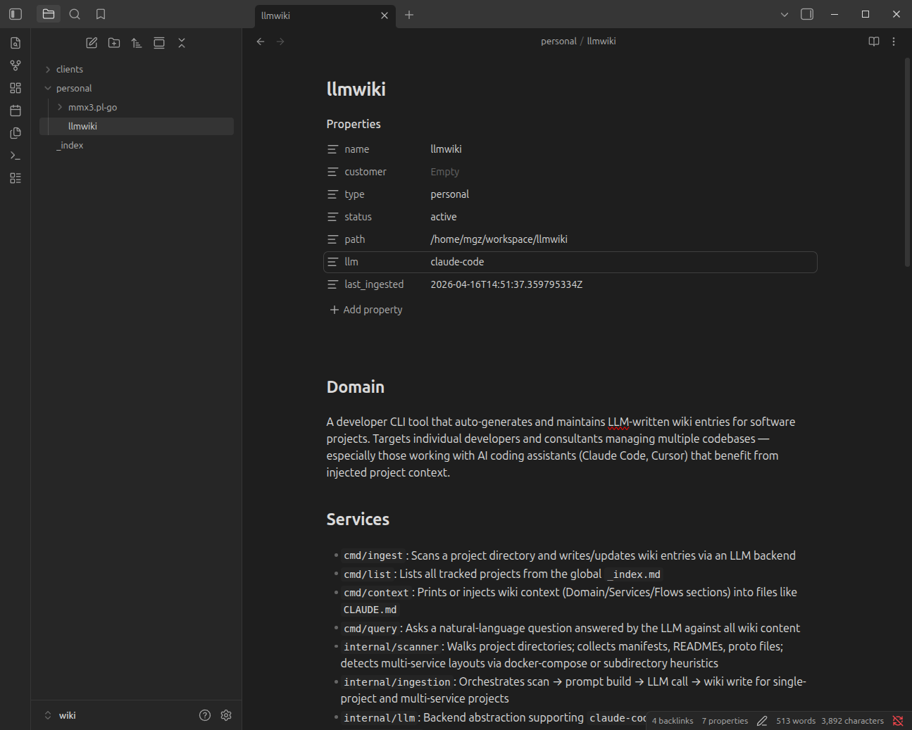
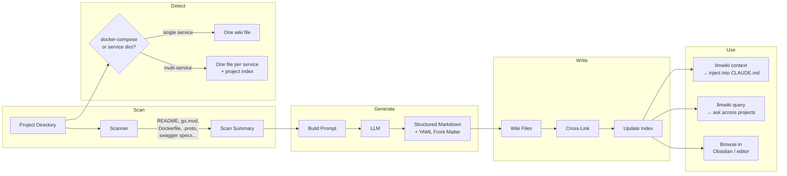
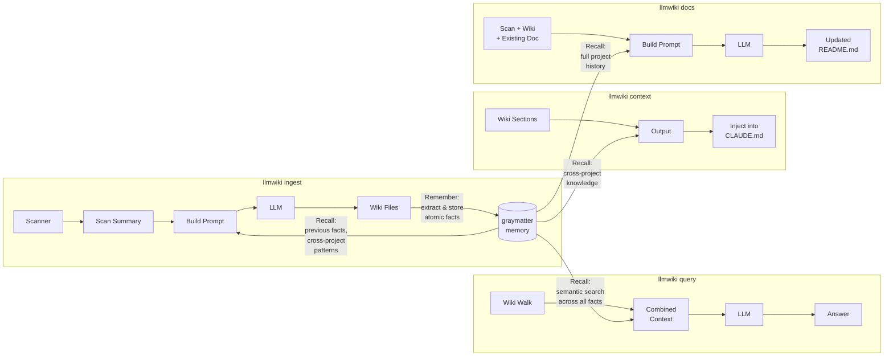
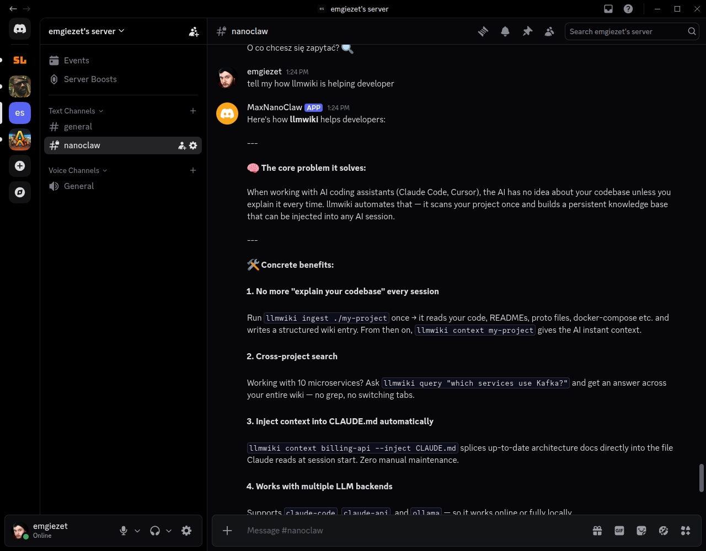
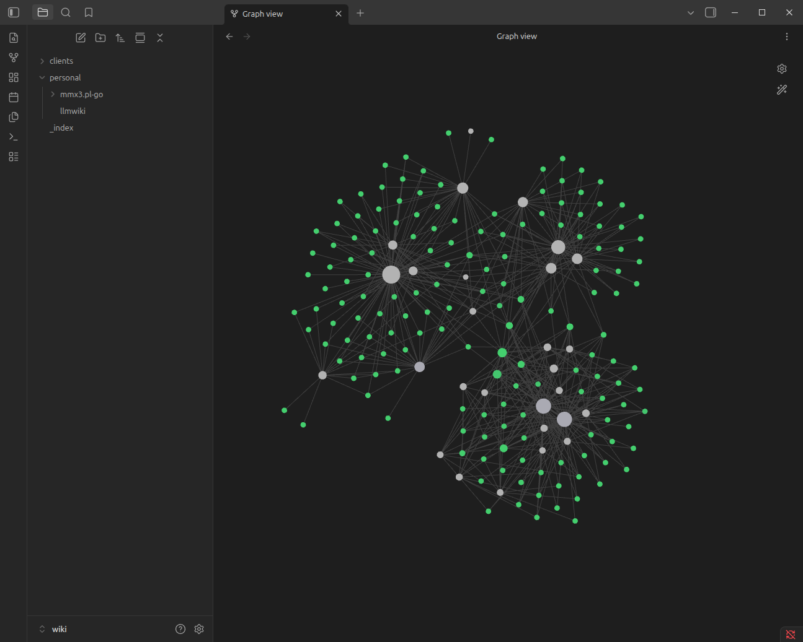

# llmwiki

**You can't keep 30 projects in your head. Neither can your AI coding assistant.**

Every developer hits a cognitive wall. You switch from the billing API to the notification service and spend 20 minutes re-reading code just to remember how it's wired together. You onboard onto a client's codebase and the architecture lives in someone's head — or worse, in a stale Confluence page from 2022. Your AI pair programmer starts every session blind, re-discovering the same project structure you explained yesterday.

`llmwiki` fixes this. It scans your project directories and generates a persistent, LLM-maintained markdown knowledge base that compounds over time. Every project gets a structured wiki entry with architecture diagrams, API documentation, integration maps, and cross-references — written by an LLM that actually reads your code, not by a developer who "will document it later."

Inspired by [Karpathy's LLM Wiki pattern](https://x.com/karpathy/status/1908184210424959371). Plain markdown files. No database. No SaaS. Browsable in any editor. Injectable into AI coding sessions. Version-controlled with git.



## The Problem

You manage multiple projects across multiple clients. Each project has its own stack, its own services, its own integration points. You context-switch between them daily. The knowledge you need is scattered across READMEs that were last updated when the project was bootstrapped, docker-compose files that hint at the architecture, and tribal knowledge that lives in Slack threads.

Your AI coding assistant starts every conversation from zero — it reads the files you point it at but has no understanding of the broader system, the other services, or why things are structured the way they are.

**What if every project had a living, always-current technical wiki — and your AI assistant could read it before writing a single line of code?**

## What llmwiki Generates

One command scans a project and produces a comprehensive wiki entry:

```bash
llmwiki ingest ~/workspace/my-api
```

The output is a structured markdown file with:
- **Domain & Architecture** — what the project does, how it's structured, key design decisions
- **Service map** — every microservice with its purpose, tech stack, and responsibilities
- **Mermaid diagrams** — system architecture flowcharts and entity-relationship diagrams, rendered in GitHub/Obsidian
- **API documentation** — endpoints extracted from swagger/openapi specs
- **Integration map** — databases, message queues, external APIs with protocols and auth methods
- **Configuration reference** — environment variables, feature flags, runtime modes
- **Auto-generated tags** — technologies and patterns in YAML front matter (`go, grpc, event-driven, kubernetes, ...`)

For clients with multiple projects, `llmwiki` generates **executive summaries** with C4 system landscape diagrams showing how everything fits together.

Every wiki file is cross-linked — mention a service name and it becomes a clickable reference to that service's wiki page.

## How It Works

### Core Pipeline



### With Graymatter Memory

When `memory_enabled: true`, [graymatter](https://github.com/angelnicolasc/graymatter) adds a persistent memory layer. Knowledge compounds across ingestion runs — the LLM sees what it learned before, cross-project patterns surface automatically, and the `query` command gets semantic search instead of brute-force file walking.



**Memory stores facts at two levels:**
- **Per-project** (`llmwiki/project/{name}`) — architecture, integrations, tech stack, service topology
- **Per-customer** (`llmwiki/customer/{name}`) — shared infrastructure, cross-project patterns, technology standards

Facts decay over time (30-day half-life) and consolidate in the background. Embedding search uses whatever's available: Ollama → OpenAI → Anthropic → keyword-only fallback.

## Install

Builds are published for macOS (arm64, amd64) and Linux (amd64, arm64).

**One-liner (recommended)**
```bash
curl -fsSL https://raw.githubusercontent.com/emgiezet/llmwiki/main/install.sh | sh
```
Installs the latest release to `~/.local/bin/llmwiki`. If that directory isn't on your `$PATH`, the installer prints the exact `export PATH=…` line to add.

**Pinned version**
```bash
curl -fsSL https://raw.githubusercontent.com/emgiezet/llmwiki/main/install.sh | VERSION=v0.5.0 sh
```

**Custom install directory**
```bash
curl -fsSL https://raw.githubusercontent.com/emgiezet/llmwiki/main/install.sh | INSTALL_DIR=/usr/local/bin sh
```

**Manual download** — grab `llmwiki_<version>_<os>_<arch>.tar.gz` from the [Releases page](https://github.com/emgiezet/llmwiki/releases), verify the SHA256 against `checksums.txt`, extract, and move `llmwiki` into your `$PATH`.

**Go users**
```bash
go install github.com/emgiezet/llmwiki@latest
```

### Updating

`llmwiki` checks GitHub once every 24 hours (cached, non-blocking) and prints a one-line notice on stderr when a newer release exists:
```
llmwiki 0.5.1 available (you have 0.5.0) — run 'llmwiki update' to install.
```

Run `llmwiki update` to upgrade. The subcommand detects how the binary was installed and re-runs the installer script for release binaries, or `go install` for Go-managed installs. Supports `--version vX.Y.Z` to pin and `--dry-run` to preview.

The notice is suppressed in CI, non-TTY output, dev builds, and when `LLMWIKI_NO_UPDATE_CHECK=1` is set.

## Quick Start

```bash
# Ingest a project
llmwiki ingest ~/workspace/my-project

# See what's tracked
llmwiki list

# Feed context to your AI coding session
llmwiki context my-project --inject CLAUDE.md

# Ask questions across all your projects
llmwiki query "which services use gRPC?"

# Generate client-level executive summary
llmwiki index acme

# Update a project's stale README from wiki + memory
llmwiki docs ~/workspace/my-project --write
```

## Features

### Automatic service detection

Point `llmwiki` at a monorepo or multi-service project and it figures out the structure. It reads `docker-compose.yml`, scans for subdirectories with code indicators (`go.mod`, `package.json`, `composer.json`, `Dockerfile`, `pom.xml`, `src/`), and creates one wiki file per service.

### Mermaid diagrams

Every wiki entry includes LLM-generated system architecture diagrams and ERDs. Client-level indexes get C4 system landscape diagrams. All render natively in GitHub, GitLab, and Obsidian.

### Cross-file linking

When a wiki entry mentions another tracked project or service, `llmwiki` automatically creates a markdown link. The result is a navigable knowledge graph — click from the client overview to a project, from a project to a service, from a service to the database it depends on.

### AI coding integration

Inject wiki context directly into `CLAUDE.md` (or any file) with marker-based replacement:

```markdown
<!-- llmwiki:start -->
<!-- llmwiki:end -->
```

```bash
llmwiki context my-project --inject CLAUDE.md
```

Your AI assistant starts every session with Domain, Architecture, Services, and Flows already in context. No more "can you look at the codebase and figure out what this does."

### Incremental refinement

Re-running `ingest` doesn't regenerate from scratch — the LLM sees the previous wiki entry and refines it. Knowledge compounds. Details get richer with each pass.

### Three LLM backends

| Backend | Config | Best for |
|---------|--------|----------|
| Claude Code CLI | `claude-code` (default) | Uses your Claude Code subscription. No API key needed. |
| Claude API | `claude-api` | Fast bulk ingestion. Requires `ANTHROPIC_API_KEY`. |
| Ollama | `ollama` | NDA code, air-gapped environments, cost control. |

### Client & project indexes

For consultants and agencies managing multiple clients:

```bash
llmwiki index acme    # executive summary across all acme projects
```

Generates a client-level `_index.md` with executive summary, C4 diagram, architecture overview, and a projects table — useful for onboarding, handoffs, and architecture reviews.

## Commands

| Command | Description |
|---------|-------------|
| `ingest <path>` | Scan a project and generate/update wiki entries |
| `ingest <path> --no-memory` | Ingest without memory recall/storage |
| `absorb <path>` | Extract session facts into memory (near-zero token cost) |
| `absorb <path> --note "..."` | Absorb with an explicit session note |
| `absorb <path> --note-stdin` | Absorb note piped from stdin (used by the Claude Code hook) |
| `absorb-drain` | Drain queued absorb sessions (created when the memory DB was busy) |
| `materialize <project>` | Rebuild wiki from accumulated memory facts (~10× cheaper than ingest) |
| `list` | List all tracked projects |
| `context <project>` | Print wiki context (pipe into CLAUDE.md) |
| `query "<question>"` | Ask a question across all wiki entries |
| `docs <path>` | Generate/update project documentation from wiki + memory |
| `docs <path> --write` | Write the updated doc to the project directory |
| `docs <path> --target FILE` | Update a specific file (default: README.md) |
| `index [customer]` | Generate client and project index files |
| `link` | Add cross-reference links between wiki files |
| `remember --project <name> "<fact>"` | Store a fact in memory |
| `recall "<query>"` | Recall facts from memory |
| `recall --project <name> "<query>"` | Recall facts for a specific project |
| `hook install` | Install llmwiki as a Claude Code plugin |
| `hook uninstall` | Remove the Claude Code plugin |
| `hook status` | Check if the Claude Code plugin is installed |

## Wiki Structure

```
~/llmwiki/wiki/
├── _index.md                              # global project listing
├── clients/
│   ├── acme/
│   │   ├── _index.md                      # client executive summary + C4 diagram
│   │   ├── billing-api.md                 # single-service project
│   │   ├── notification-service.md
│   │   └── ecommerce/
│   │       ├── _index.md                  # project overview + service table
│   │       ├── cart-service.md            # per-service wiki
│   │       ├── payment-service.md
│   │       └── ...
│   └── globex/
│       ├── _index.md                      # client executive summary
│       └── platform/
│           ├── _index.md
│           ├── auth-service.md
│           └── ...
├── personal/
│   └── my-tool.md
└── opensource/
    └── some-lib.md
```

Plain markdown with YAML front matter. No proprietary format. Works with git, grep, and any text editor.

## NanoClaw Integration

llmwiki works with [NanoClaw](https://nanoclaw.com) — a Discord bot that can query your wiki knowledge base and answer project questions directly in your Discord server.



Ask NanoClaw questions about any of your tracked projects and it draws on the wiki entries llmwiki generated. See [docs/nanoclaw-integration.md](docs/nanoclaw-integration.md) for setup instructions.

## Obsidian Compatibility



The wiki directory works as an [Obsidian](https://obsidian.md/) vault out of the box:

1. Open Obsidian, choose "Open folder as vault", select `~/llmwiki/wiki/`
2. Mermaid diagrams render natively in preview mode
3. Cross-file links are clickable — navigate from client to project to service
4. YAML front matter shows as properties
5. Tags are searchable via the tag pane
6. Graph view visualizes your entire knowledge base

## Configuration

### Per-project: `llmwiki.yaml`

```yaml
type: client         # client | personal | oss
customer: acme
llm: ollama          # claude-code | claude-api | ollama
ollama_model: llama3.2
```

### Global: `~/.llmwiki/config.yaml`

```yaml
wiki_root: ~/llmwiki/wiki
llm: claude-code
ollama_host: http://localhost:11434
anthropic_api_key: ""   # or set ANTHROPIC_API_KEY env var
memory_enabled: false   # enable graymatter persistent memory
memory_dir: ~/.llmwiki/memory   # where gray.db lives
```

Per-project config overrides global. If neither exists, defaults to `claude-code` with wiki at `~/llmwiki/wiki/`.

### Memory

Set `memory_enabled: true` in your global config to activate [graymatter](https://github.com/angelnicolasc/graymatter) integration. Memory is stored in a single `gray.db` file at `~/.llmwiki/memory/`. It reuses your existing `anthropic_api_key` for embeddings, and falls back to Ollama or keyword-only search if no key is available.

Seed tribal knowledge that the scanner can't detect:

```bash
llmwiki remember --project my-api "billing service was rewritten from PHP to Go in Q1 2025"
llmwiki remember --project my-api "uses custom auth middleware in pkg/auth, not standard library"
llmwiki recall "which projects use gRPC?"
```

## Automatic Session Capture (Claude Code Hook)

Every time Claude reads your code and explains how something works, that understanding exists only in the conversation — it vanishes when the session ends. The Claude Code hook captures it automatically.

### How it works

llmwiki ships as a Claude Code plugin. After installation, a Stop hook fires at the end of every qualifying turn (assistant response >300 chars with at least one file-reading tool call). It reads the session transcript, extracts the last analytical response, and pipes it to `llmwiki absorb` — storing the insight in graymatter memory with zero user action.

Later, regenerate or update the wiki without re-scanning the codebase:

```bash
llmwiki materialize my-project   # ~5-15K tokens vs 50-100K for full ingest
```

### Install

```bash
# Install the Claude Code plugin
llmwiki hook install

# Check it's active
llmwiki hook status

# Restart Claude Code — the plugin is auto-discovered
```

The plugin is written to `~/.claude/plugins/llmwiki/`. Claude Code detects it on next launch.

To remove:

```bash
llmwiki hook uninstall
```

### Manual install (if you have the repo)

Symlink the bundled plugin directory instead of running the command:

```bash
ln -s /path/to/llmwiki/plugin ~/.claude/plugins/llmwiki
```

### Requirements

- `memory_enabled: true` in `~/.llmwiki/config.yaml`
- `llmwiki` in your `$PATH` (so the hook script can call it)
- Python 3 (used by the hook script; standard on macOS and most Linux distros)

### Lock contention and the absorb queue

If the Stop hook fires while another process holds the memory DB (for example, you have `graymatter tui` open), llmwiki appends the session to a local queue file (`~/.llmwiki/memory/absorb-queue.jsonl` by default). The queue is drained the next time `llmwiki absorb` runs successfully, or explicitly via `llmwiki absorb-drain`.

### Incremental wiki building

The hook + materialize workflow is designed for ongoing sessions where a full `ingest` run would be too expensive. Facts accumulate silently across sessions; you run `materialize` when you want a refreshed wiki entry.

You can also capture explicit insights during a session:

```bash
llmwiki remember --project my-api "retry logic uses exponential back-off with jitter in pkg/retry"
```

---

## Security

llmwiki v1.0 shipped after a baseline security audit. Highlights:
- Path-traversal rejection on all filesystem-bound inputs
- Fenced + scrubbed LLM prompt/response pipeline
- Loopback-only default for Ollama (SSRF defense)
- Bounded subprocess and HTTP deadlines
- Symlink-TOCTOU refused during directory walks

See [SECURITY.md](SECURITY.md) for the threat model, supported versions, and
how to report a vulnerability. The reproducible CI gate lives in
[.github/workflows/security.yml](.github/workflows/security.yml); run it
locally with `make security-scan`.

---

## Who This Is For

- **Consultants** juggling 5+ client codebases who can't afford to re-learn each one every Monday
- **Tech leads** who need architecture documentation that actually reflects the code
- **Developers using AI assistants** who are tired of re-explaining project structure every session
- **Teams onboarding new engineers** who want a "read this first" that writes itself
- **Anyone** who has ever thought "I'll document this later" and never did

## Releases

Releases are cut automatically from commit history on `main`:

- **`feat:`** — new feature → minor bump (`0.4.0 → 0.5.0`)
- **`fix:`** — bug fix → patch bump (`0.5.0 → 0.5.1`)
- **`feat!:`** or `BREAKING CHANGE:` in the body → major bump (`0.5.0 → 1.0.0`)
- Anything else (`docs:`, `chore:`, `refactor:`, …) ships silently with the next tagged release.

[release-please](https://github.com/googleapis/release-please) maintains a running "Release PR" that accumulates unreleased commits. Merging that PR creates the git tag and GitHub Release; the release workflow then builds binaries for all four target platforms and attaches them along with `checksums.txt` and `install.sh`.

See all releases: [github.com/emgiezet/llmwiki/releases](https://github.com/emgiezet/llmwiki/releases).

## License

MIT
