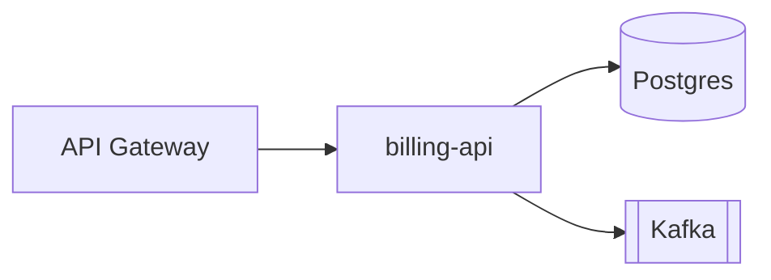

# llmwiki

> Turn any codebase into a living, LLM-maintained wiki — with architecture diagrams, cross-linked services, and automatic staleness detection.

[](LICENSE)
[](https://github.com/emgiezet/llmwiki/releases/latest)
[](go.mod)
[](https://github.com/emgiezet/llmwiki/actions/workflows/ci.yml)

**You can't keep 30 projects in your head. Neither can your AI coding assistant.**

Docs rot the moment you write them. `llmwiki` scans a project and generates a persistent, LLM-maintained markdown wiki — architecture diagrams, service maps, integration maps, cross-links — then flags entries when the code drifts away from the docs. Plain markdown, no database, no SaaS. Inspired by [Karpathy's LLM Wiki pattern](https://x.com/karpathy/status/1908184210424959371).


## Quick start

```bash
# 1. Install (macOS / Linux)
curl -fsSL https://raw.githubusercontent.com/emgiezet/llmwiki/main/install.sh | sh

# 2. Configure once (interactive)
llmwiki setup

# 3. Generate a wiki for any project
llmwiki ingest ~/workspace/my-api
```

`my-api` now has a structured wiki entry with diagrams and cross-links. More install options (Go, pinned versions, pre-built binaries) → [docs/installation.md](docs/installation.md).

## What you get

One `ingest` turns a repo into a structured markdown file — domain & architecture, a service map, API docs, an integration map, auto-generated tags, and **Mermaid diagrams that render right here on GitHub**:



Multi-client setups also get executive summaries with C4 diagrams, and every file is cross-linked into a navigable knowledge graph. See how the pipeline works → [docs/architecture.md](docs/architecture.md).

> **Under NDA?** Keep your default backend on the Claude Code subscription and override just the secret project to a local **Ollama** model — that project's code never leaves your machine. No cloud calls, no NDA risk. → [NDA / local-LLM recipe](docs/configuration.md#nda-projects-local-llm-override)

## Features

- **Automatic service detection** — reads `docker-compose.yml` + code indicators, one wiki file per service.
- **Mermaid diagrams** — architecture flowcharts, ERDs, and C4 landscapes; render in GitHub/GitLab/Obsidian.
- **Cross-file linking** — service mentions become clickable links across the knowledge graph.
- **AI-coding integration** — inject Domain/Architecture/Services/Flows straight into `CLAUDE.md`.
- **MCP server** — agents query the extracted wiki over stdio (`llmwiki mcp`), filtered by client/project, no LLM call.
- **Incremental refinement** — re-running `ingest` refines the previous entry instead of starting over.
- **Change tracking & freshness** — knows which source files each entry describes and flags drift (`llmwiki check`).
- **Docs alongside code** — write wikis into the repo (`output_mode: local|both`) so one PR shows code + doc.
- **Three LLM backends** — Claude Code subscription, Claude API, or local Ollama.
- **Sovereign / local-first** — run fully offline on a local Ollama model; code never leaves the box.
- **Not just code** — build wikis from notes, research, and articles via document extraction (PDF/DOCX/ODT/EPUB).
- **Client & project indexes** — executive summaries across all of a client's projects.

## Documentation

| Guide | What's inside |
|-------|---------------|
| [Installation](docs/installation.md) | Download, one-liner installer, Go install, updating, releases |
| [Configuration](docs/configuration.md) | Global / client / project config, presets, non-code projects & document extraction, NDA local-LLM recipe |
| [Commands](docs/commands.md) | Full command reference, wiki layout, freshness tracking, CLAUDE.md injection |
| [Memory](docs/memory.md) | graymatter persistent memory, modes, seeding, absorb queue |
| [Integrations](docs/integrations.md) | Supported AI tools & session hooks, Obsidian, NanoClaw |
| [Architecture](docs/architecture.md) | How the scan → generate → write pipeline works |

## Who it's for

Consultants juggling many client codebases, tech leads who need docs that match the code, and developers tired of re-explaining project structure to their AI assistant every session.

## Security

Path-traversal rejection, scrubbed LLM prompt/response pipeline, loopback-only Ollama default, bounded subprocess/HTTP deadlines. See [SECURITY.md](SECURITY.md) and the [threat model](docs/threat-model.md); the CI gate lives in [.github/workflows/security.yml](.github/workflows/security.yml).

## License

MIT
