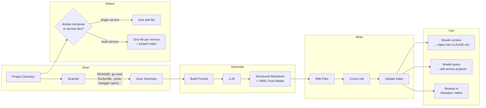
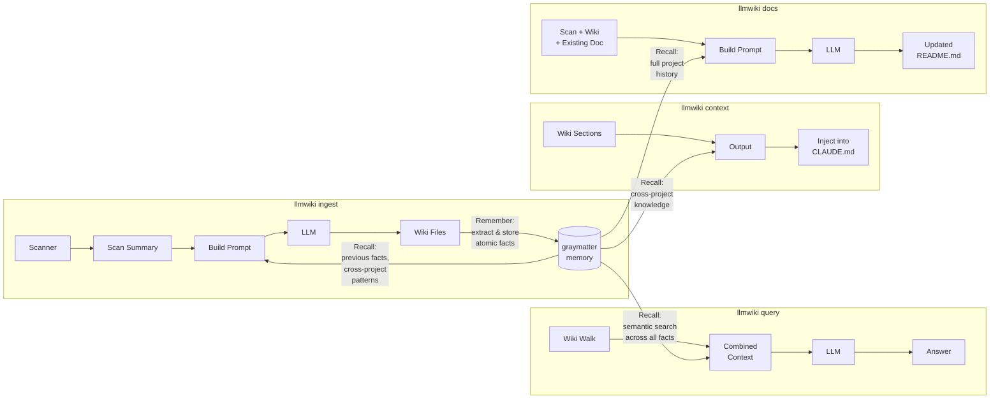

# How It Works

The scan → detect → generate → write pipeline, and how graymatter memory layers on top.

[← Back to README](../README.md)

## Core Pipeline

## With Graymatter Memory

When `memory_enabled: true`, [graymatter](https://github.com/angelnicolasc/graymatter) adds a persistent memory layer. Knowledge compounds across ingestion runs — the LLM sees what it learned before, cross-project patterns surface automatically, and the `query` command gets semantic search instead of brute-force file walking.

**Memory stores facts at two levels:**
- **Per-project** (`llmwiki/project/{name}`) — architecture, integrations, tech stack, service topology
- **Per-customer** (`llmwiki/customer/{name}`) — shared infrastructure, cross-project patterns, technology standards

Facts decay over time (30-day half-life) and consolidate in the background. Embedding search uses whatever's available: Ollama → OpenAI → Anthropic → keyword-only fallback.
