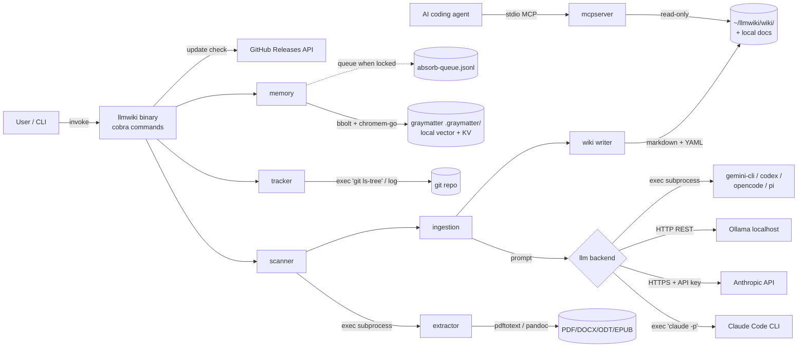
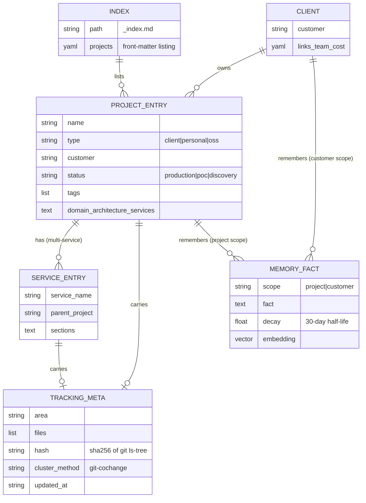

## Domain

`llmwiki` is a command-line tool that turns any codebase (or corpus of documents) into a persistent, LLM-maintained markdown wiki. It addresses documentation rot: hand-written architecture docs drift out of date the moment code changes, and neither a human nor an AI coding assistant can hold the structure of dozens of projects in working memory at once.

The tool scans a project directory, feeds a structured summary to an LLM, and writes back a cross-linked markdown entry containing a domain overview, service map, integration map, Mermaid diagrams, auto-generated tags, and YAML front matter. It then tracks which source files each entry describes and flags entries as stale when the underlying code drifts. The output is plain markdown with no database and no SaaS dependency, so it works with git, grep, any text editor, and Obsidian out of the box.

The intended users are developers and especially consultants/agencies juggling many client projects, who need durable, queryable knowledge bases for onboarding, handoffs, and architecture reviews. A secondary audience is AI coding agents themselves: wiki content can be injected into `CLAUDE.md` or queried over an MCP server so an assistant starts each session already grounded in a project's architecture. The pattern is explicitly inspired by Karpathy's "LLM Wiki" idea. A notable design constraint is NDA/sovereignty support: a single confidential project can be routed to a local Ollama model so its source never leaves the machine, while everything else uses a cloud [backend](../personal/ai-szkolenie/backend.md).

## Architecture

`llmwiki` is a single statically-linked Go binary built as a [cobra](https://github.com/spf13/cobra) CLI. `main.go` constructs the root command and wires roughly two dozen subcommands, each living in `internal/cmd/`. There is no long-running server (except the on-demand stdio MCP server); every invocation is a short-lived process. This is a deliberate monolith — there are no microservices, and the "components" are internal Go packages decomposed by [pipeline](../clients/insly/poland-gtc-automation/pipeline.md) stage.

The core data flow for `ingest` is:

**`scanner` (+ `extractor`) → `ingestion` → `llm` → `wiki`**

1. **`internal/scanner`** walks a project directory and collects relevant files (README, `go.mod`, `docker-compose.yml`, `.proto`, swagger specs, etc.) into one text summary. `DetectServices` auto-detects multi-service layouts from `docker-compose.yml` first, then subdirectory heuristics. When a `WithExtractor` option is supplied, binary document files are converted to text and folded in (capped at 50 files / ~50 KB each).
2. **`internal/ingestion`** orchestrates the pipeline: scan → build prompt → LLM call → write. `IngestProject` branches on service detection — zero services yields a single project file, one or more yields a file per service plus an index.
3. **`internal/llm`** hides the model behind a one-method `LLM` interface (`Generate(ctx, prompt) (string, error)`) with seven backends.
4. **`internal/wiki`** owns the on-disk markdown format (entries with YAML front matter, the master `_index.md`) and a read-only query layer (`query.go` / `Store`).

The codebase leans heavily on dependency-injection seams for testability: the `LLM` interface (`NewFakeLLM` test double), `GitRunner` (real subprocess vs `fakeGitRunner`), the `Extractor` interface, and the `wizard.Prompter` with injectable I/O. Significant cross-cutting concerns are isolated into their own packages — `internal/safeio` (path-safe file ops), `internal/validation` (name sanitization against malicious repos), `internal/config` (three-layer merge), and `internal/tracker` (git-based freshness). The build pipeline is GitHub Actions + goreleaser + release-please, with a dedicated security-scan gate.

## Services

This is a single binary, not a service mesh; the "components" below are the internal Go packages and the runtime processes the binary spawns.

- **internal/cmd** — Go (cobra). Defines every subcommand (`ingest`, `check`, `query`, `context`, `mcp`, `init`, `setup`, `index`, `link`, `remember`/`recall`, `docs`, `absorb`/`drain`, `materialize`, `hook`, `client`, `version`/`update`) and the hook installers for Claude Code/codex/opencode/pi/gemini-cli.
- **internal/scanner** — Go. Walks the project tree, collects relevant files into a scan summary, and detects single- vs multi-service layouts.
- **internal/extractor** — Go. Shells out to configurable external converters (`pdftotext`, `pandoc`) to turn `.pdf`/`.docx`/`.odt`/`.epub` into text; missing [tools](../s/konferencje/tools.md) yield `ErrToolNotFound` and the file is skipped.
- **internal/ingestion** — Go. Pipeline orchestrator; builds prompts, calls the LLM, writes entries, generates indexes, tags, and tracking metadata.
- **internal/llm** — Go. Backend abstraction with seven implementations: `claude-code`, `claude-api`, `ollama`, `gemini-cli`, `codex`, `opencode`, `pi`.
- **internal/wiki** — Go. Markdown + YAML front matter read/write, master index upsert, cross-file linking, and the LLM-free `Store` query layer backing the MCP server.
- **internal/mcpserver** — Go (modelcontextprotocol/go-sdk). Stdio MCP server exposing `search_projects` and `get_project` as thin wrappers over `wiki.Store`.
- **internal/tracker** — Go. Git co-change clustering (union-find, 30% threshold), content-addressed area hashing from `git ls-tree HEAD`, and freshness comparison.
- **internal/config** — Go. Two-/three-layer config (global → client → project) with per-field `Merge`.
- **internal/memory** — Go (graymatter). Persistent vector memory layer, lock-contention handling, and the absorb queue.
- **internal/wizard** — Go. Dependency-free interactive prompt helpers for `setup` and `init`.
- **internal/safeio / validation / update / version** — Go. Path-safe I/O, name validation, self-update checks against GitHub, and version embedding.

## Features

- **Automatic service detection** — reads `docker-compose.yml` plus code indicators and writes one wiki file per service, with a project index.
- **Structured wiki generation** — domain, architecture, service map, API docs, integration map, auto-generated tags, and Mermaid diagrams (flowcharts, ERDs, C4 landscapes) that render on GitHub/GitLab/Obsidian.
- **Cross-file linking** — service mentions become clickable links across the knowledge graph; client- and project-level executive-summary indexes.
- **AI-coding integration** — inject Domain/Architecture/Services/Flows into `CLAUDE.md` via marker-based replacement (`llmwiki context --inject`).
- **MCP server** — agents query the extracted wiki over stdio with deterministic, LLM-free structured results, filtered by client/project.
- **Change tracking & freshness** — knows which source files each entry describes and flags drift via `llmwiki check` (with `--json`, `--exit-code`, `--files`), a Git pre-commit hook, and an AI-session Stop hook.
- **Incremental refinement & materialize** — re-running `ingest` refines rather than overwrites; `materialize` rebuilds an entry from accumulated memory facts at ~10× lower cost.
- **Persistent memory (graymatter)** — passive session capture (`absorb`), explicit `remember`/`recall`, decaying facts at project and customer scope.
- **Document extraction** — builds wikis from notes/research/articles (PDF/DOCX/ODT/EPUB) with prose-oriented `notes`/`research` presets.
- **Three generation LLM backends + seven CLI integrations** — Claude Code subscription, Claude API, or local Ollama; hook-based session capture for Claude Code, codex, opencode, pi, and gemini-cli.
- **Sovereign / local-first** — per-project Ollama override keeps NDA code off the network.
- **Docs alongside code** — `output_mode: local|both` writes wikis into the repo so one PR shows code + docs.
- **Interactive wizards & self-update** — `llmwiki setup`/`init` wizards, shell completion, and a non-blocking 24-hour update check with `llmwiki update`.

## Flows

**Ingest (single project):** `llmwiki ingest <path>` → `scanner.ScanProject` walks the tree and (optionally) routes documents through `extractor` → `ingestion` builds a prompt that fences untrusted scan data as data-only → selected `llm` backend `Generate`s structured markdown → response is scrubbed of structural markers → `wiki.WriteProjectEntry` writes the file with front matter (including the `llmwiki_tracking` block built by `ingestion.buildTracking`) → `wiki.UpsertIndex` updates `_index.md`. With `output_mode: both`, the entry is written to both the central tree and `<project>/<local_docs_dir>/`.

**Ingest (multi-service):** same path, but `DetectServices` returns ≥1 service → one file per service (`WriteServiceEntry`) plus a project `_index.md` with a service table → cross-linker connects service mentions.

**Freshness check:** `llmwiki check` → `wiki` reads entries → `tracker.CheckFreshness` recomputes the content hash from `git ls-tree HEAD` for each tracked area and compares it to the stored hash → fresh/stale report. Three triggers share this path: manual run, the `init --hooks` pre-commit hook (blocks commit via `--exit-code` when staged files are in a stale area; `--no-verify` bypasses), and the graymatter Stop hook (non-blocking, records signal in memory).

**MCP query:** an agent connects to `llmwiki mcp` over stdio → `mcpserver` handler calls `wiki.Store.Search` (client = exact case-insensitive, project = substring) or `Store.GetProject` → returns structured metadata/content with no LLM call.

**Memory capture (async):** an AI session ends → tool-specific hook reads the transcript → pipes the last response to `llmwiki absorb` → `internal/memory` stores atomic facts. If the memory DB is locked, the session is appended to `absorb-queue.jsonl` and drained later by `absorb-drain` or the next successful `absorb`. `materialize` later rebuilds the wiki from those facts.

**Self-update:** `main.go` kicks off `update.NewChecker().CheckAsync` before arg parsing → non-blocking drain at exit prints a one-line stderr notice when a newer GitHub release exists (suppressed in CI/non-TTY/dev builds or with `LLMWIKI_NO_UPDATE_CHECK=1`).

## System Diagram



## Data Model Diagram

No relational/SQL schema exists — persistence is markdown-with-front-matter plus graymatter's local stores (bbolt KV + chromem-go vectors). The diagram below models the conceptual persisted entities and their relationships as visible in the scan.



## Integrations

**Databases / local stores**
- **graymatter memory store** — local, file-based. Uses `go.etcd.io/bbolt` (KV) and `philippgille/chromem-go` (embedded vector store) under `.graymatter/` (project mode) or `memory_dir` (global mode). No network; concurrent access degrades gracefully via file lock with the `absorb-queue.jsonl` fallback. Embeddings resolve in order Ollama → OpenAI → Anthropic → keyword-only.

**Message queues**
- None. The only queue is the local append-only `absorb-queue.jsonl` for deferred memory writes.

**External APIs / processes**
- **Anthropic API** — HTTPS via `anthropic-sdk-go`, used by the `claude-api` backend. Auth: `ANTHROPIC_API_KEY` env var (or config, with a security warning).
- **Ollama** — HTTP REST to `ollama_host` (`/[api](../personal/claim-fraud-photo-analyzer/api.md)/chat`, switched from `/api/generate` in v2.4.1 to prevent special-token leakage). Default host allowlist is loopback-only; remote requires `allow_remote_ollama: true` (SSRF mitigation, threat A5).
- **Claude Code / gemini-cli / codex / opencode / pi** — invoked as subprocesses (the `claude -p` pattern and CLI backends); also targets for hook-based session capture.
- **git** — subprocess (`git ls-tree HEAD`, log) via the `GitRunner` interface, for co-change clustering and freshness hashing.
- **pandoc / pdftotext** — subprocesses for document extraction; missing binaries are skipped, not fatal.
- **GitHub Releases API** — HTTPS, for the 24-hour update check and `llmwiki update`.
- **MCP clients** — agents connect over stdio (`StdioTransport`); deterministic file reads, no LLM call.

**Observability**
- None detected. Failures degrade gracefully (hooks always exit 0; update checks are best-effort; missing tools are skipped).

## Tech Stack

- **Language:** Go 1.25.10 (module `github.com/emgiezet/llmwiki`).
- **CLI framework:** `spf13/cobra` v1.10.2 (+ `pflag` v1.0.10).
- **LLM / agents:** `anthropics/anthropic-sdk-go` v1.36.0; Ollama REST; subprocess CLIs (claude, gemini, codex, opencode, pi).
- **MCP:** `modelcontextprotocol/go-sdk` v1.6.1 (+ `google/jsonschema-go`).
- **Memory:** `angelnicolasc/graymatter` v0.5.0, `philippgille/chromem-go` v0.7.0 (MPL-2.0), `go.etcd.io/bbolt` v1.3.11, `oklog/ulid/v2`.
- **Parsing / util:** `gopkg.in/yaml.v3` v3.0.1, `golang.org/x/mod` v0.35.0, `tidwall/gjson|sjson|match|pretty`, `segmentio/encoding`.
- **Diagrams:** Mermaid (rendered by GitHub/GitLab/Obsidian, not a build dep).
- **Testing:** `stretchr/testify` v1.11.1; `go test -race`; Go fuzz tests (`*_fuzz_test.go` in config/scanner/wiki); JS test for the Node Stop hook (`stop-hook.test.js`).
- **Quality / security gate:** `go vet`, `staticcheck`, `gosec` (excluding G304/G204 by design), `govulncheck`, `osv-scanner`, `gitleaks`; SBOM via `cyclonedx-gomod`; `go-licenses`. Aggregated in the `Makefile` `security-scan` target and `.github/workflows/security.yml` (weekly cron re-scan).
- **CI/CD:** GitHub Actions — `ci.yml` (tidy check, vet, build, race tests, staticcheck, soft govulncheck), `security.yml`, `release-please.yml` (conventional-commit release PR + chained goreleaser), `release.yml`. Cross-platform binaries (darwin/linux × amd64/arm64) via `goreleaser`; distribution via `install.sh`, Docker (`Dockerfile.goreleaser`), and a pending Homebrew tap and npm wrapper (`npm/`).
- **Runtime deps for some features:** Node.js ≥ 18 (Claude Code / codex hooks), `git`, `pandoc`, `pdftotext`.

## Configuration

Config resolves in three layers, each overriding the previous per-field: **global → client → project**.

- **Global `~/.llmwiki/config.yaml`:** `wiki_root`, `llm` (default `claude-code`), `ollama_host`, `ollama_model`, `anthropic_api_key`, `memory_enabled`, `memory_mode` (`project`|`global`), `memory_dir`, `extractors` (extension→command template with `{{input}}`), and binary path overrides (`claude_binary_path`, `gemini_binary_path`, `codex_binary_path`, `opencode_binary_path`, `pi_binary_path`).
- **Per-client `~/.llmwiki/clients/<customer>.yaml`:** baseline inherited by every project with that `customer` — `status`, `llm`, `links`, `team`, `cost`, `extraction` defaults.
- **Per-project `llmwiki.yaml`:** `type` (`client`|`personal`|`oss`), `customer`, `status` (`production`|`poc`|`discovery`, drives section preset), `llm`, `ollama_model`, `output_mode` (`central`|`local`|`both`), `local_docs_dir`, `extraction.preset` (`software`|`notes`|`research`), `links`, `team`, `cost`, `memory_dir` (worktree share pattern).

**Environment variables:** `ANTHROPIC_API_KEY` (preferred over storing the key in config), `LLMWIKI_NO_UPDATE_CHECK=1` (suppress update check), `GORELEASER_CURRENT_TAG`/`GITHUB_TOKEN` (release CI), `HOMEBREW_TAP_TOKEN` (release secret, pending).

**Runtime modes / flags:** `--status` override, `--no-memory`, `--hooks`/`--no-graymatter` on `init`, `check --json|--exit-code|--files`, `mcp --wiki-root`, `update --version|--dry-run`, `allow_remote_ollama` (SSRF escape hatch). Section presets are status-driven (production/discovery/poc) unless an explicit preset/sections override is set.

Required vs optional: nothing is strictly required to start — with no config, llmwiki defaults to `claude-code` and `~/llmwiki/wiki/`. `claude-api` requires `ANTHROPIC_API_KEY`; Ollama requires a reachable host and a pulled model; memory features require `memory_enabled: true`.

## Notes

- **Security is a first-class concern.** The repo ships a full threat model (`docs/threat-model.md`) and supply-chain audit (`docs/supply-chain.md`). Untrusted scan input is fenced as data-only in prompts, LLM responses are scrubbed of structural markers before writing, customer/project/service names are validated, non-regular files and non-UTF-8 files are refused in the scanner (symlink TOCTOU), and `gosec` deliberately excludes G304/G204 because reading user paths and shelling out is intended design.
- **Prompt injection is acknowledged as defense-in-depth only** — a general solution is an open problem. Treat any wiki content that flows into `CLAUDE.md` as potentially attacker-influenced if generated from a hostile repo.
- **License note:** all deps are MIT/Apache-2.0/BSD-3-Clause except `chromem-go` (MPL-2.0, file-level copyleft). Consuming it unmodified via `go get` carries no distribution obligation; forking/patching its files would.
- **Pre-1.0 dependency risk:** `graymatter` and `chromem-go` are single-maintainer pre-1.0 projects, accepted-with-version-pin; `go.sum` + the Go checksum DB guard against re-tag attacks. Fallback plan is to vendor them.
- **Migration history:** the Claude Code Stop hook was rewritten from Python to Node.js (v2.0.0, a breaking change with auto-migration on hook reinstall); the Ollama backend moved from `/api/generate` to `/api/chat` (v2.4.1). Note `docs/threat-model.md` still references the legacy "embedded Python Stop-hook" while the active script is `stop-hook.js`.
- **Releases are automated** from conventional commits via release-please; merging the running Release PR cuts the tag and triggers goreleaser in the same workflow (a `GITHUB_TOKEN` tag push wouldn't trigger the standalone `release.yml`, hence the chaining).
- **Cost-aware design:** `materialize` (~5–15K tokens) is offered as a ~10× cheaper alternative to a full `ingest` (~50–100K tokens), and the MCP server / `query` distinction is deliberate — MCP returns deterministic file reads with no LLM spend.
- **Branch context:** current work is on `feat/distribution` — adding Docker, an npm wrapper, Homebrew, and a `.mcp.json`, expanding install/distribution surface.
## Cost

_No cost data recorded yet._ To populate this section, add to your project's `llmwiki.yaml`:

```yaml
cost:
  infra_monthly_usd: <AWS/GCP/etc bill for this project, monthly average>
  team_fte: <FTE count primarily working on this project>
  team_fte_rate_usd_monthly: <fully-loaded monthly cost per FTE>
```

Or set `team_fte_rate_usd_monthly` once at the client level in `~/.llmwiki/clients/<customer>.yaml` and individual projects only need to supply their FTE count + infra number.

